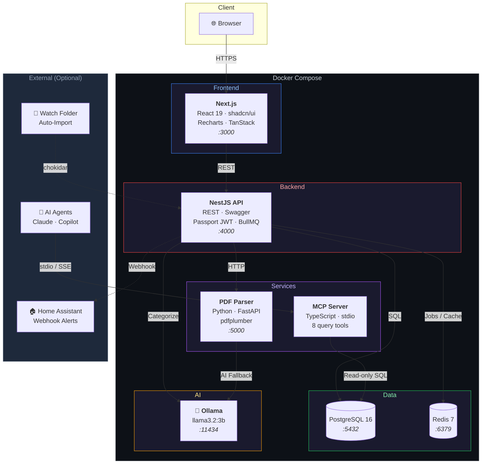
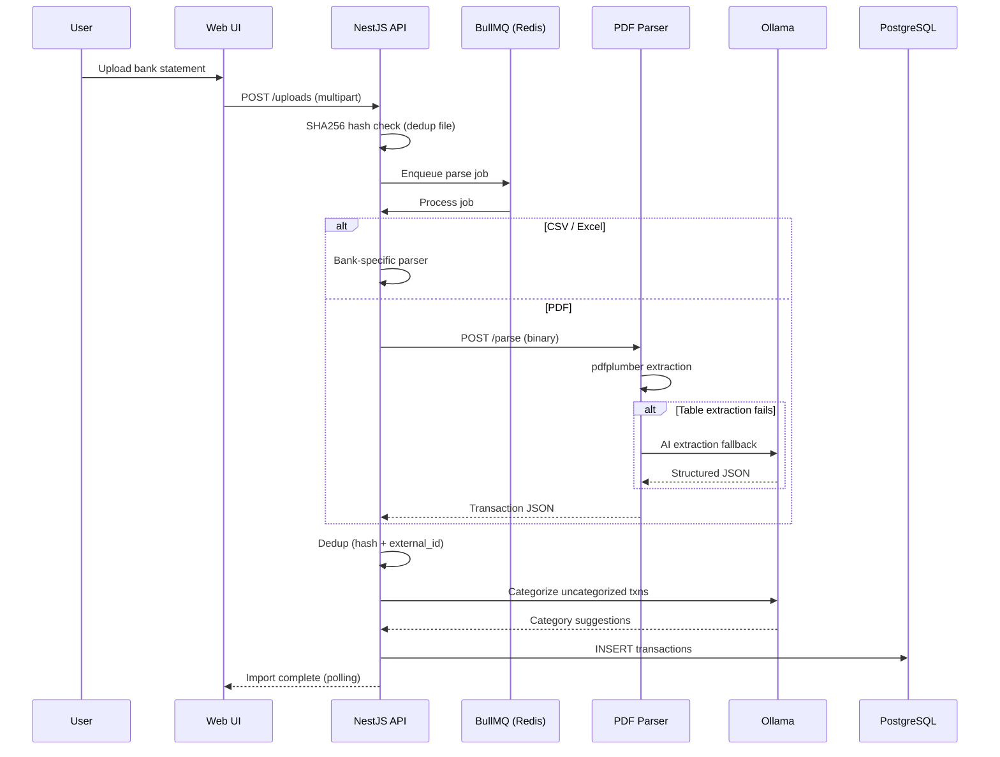
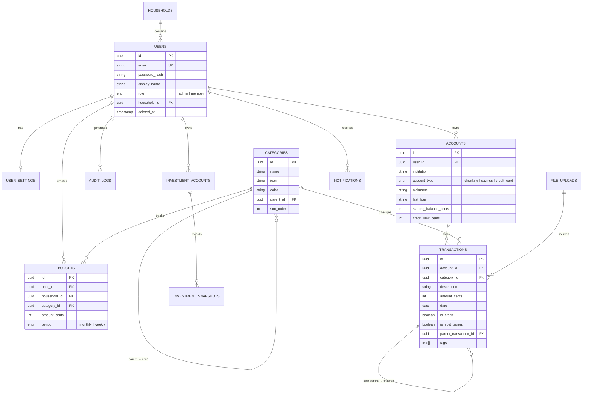

<h1 align="center">
  💸 MoneyPulse
</h1>

<p align="center">
  <strong>A self-hosted personal finance tracker with AI-powered categorization</strong>
</p>

<p align="center">
  <a href="#features">Features</a> •
  <a href="#architecture">Architecture</a> •
  <a href="#tech-stack">Tech Stack</a> •
  <a href="#getting-started">Getting Started</a> •
  <a href="#project-structure">Project Structure</a> •
  <a href="#roadmap">Roadmap</a>
</p>

<p align="center">
  
  
  
  
  
  
  
  
</p>

---

MoneyPulse is a **privacy-first**, self-hosted personal finance application designed to run on a home NAS (Ugreen) or any Docker-capable server. Import bank statements from **Bank of America, Chase, Amex, and Citi** (CSV, Excel, PDF), let a **local AI model** automatically categorize your transactions, and visualize your spending through an **interactive dashboard** — all without your financial data ever leaving your network.

## Why MoneyPulse?

Most finance apps require uploading sensitive bank data to third-party servers. MoneyPulse takes a different approach:

- **🔒 Your data stays local** — runs entirely on your hardware, no cloud dependency
- **🤖 AI without the privacy trade-off** — Ollama runs locally for transaction categorization
- **🏠 Household-aware** — multi-user support with shared and personal budgets
- **📂 Drop-and-forget ingestion** — watch folders auto-import new statements
- **🔌 Smart home integration** — budget alerts via Home Assistant webhooks
- **🧩 AI agent ready** — MCP server lets Claude, Copilot, or custom agents query your finances

## Features

### Bank Statement Ingestion
- **CSV/Excel import** with bank-specific parsers (BofA, Chase, Amex, Citi)
- **PDF extraction** via dedicated Python microservice (pdfplumber + AI fallback)
- **Generic CSV** with configurable column mapping for any bank
- **Watch folder** — drop files into a mapped directory for automatic import
- **Dedup engine** — hash-based + external ID matching prevents duplicate imports
- **Partial import** — valid rows imported, errors logged per-row

### AI-Powered Categorization
- **Local-first** — Ollama (llama3.2:3b) categorizes transactions on-device
- **60+ seed rules** — common merchants pre-mapped out of the box
- **Learning rules engine** — manual overrides auto-create future categorization rules
- **Cloud AI opt-in** — PII-stripped fallback to cloud models (default OFF)

### Dashboard & Analytics
- Income vs. expenses (monthly bar chart)
- Spending by category (donut chart)
- Spending trend over time (line chart)
- Account balance history (multi-line chart)
- Credit card utilization (progress bars)
- Net worth tracking (including investments)
- Top merchants by spend

### Budgets & Alerts
- Per-category monthly/weekly budgets (personal + shared household)
- Savings goals with projected completion dates
- 80% warning / 100% over-budget thresholds
- **Home Assistant webhooks** for real-time push notifications
- Email digests (weekly spending summary)

### Transaction Management
- Full-text search with multi-column filtering
- Inline category editing with auto-rule creation
- Bulk selection and categorization
- Split transactions (e.g., Walmart → Groceries + Household)
- Manual entry for cash transactions
- CSV export

### MCP Server (AI Agent Integration)
8 tools for querying your finances from any MCP-compatible AI agent:

| Tool | Description |
|------|-------------|
| `get_transactions` | Query transactions with filters |
| `get_spending_summary` | Grouped totals by category/merchant |
| `get_budget_status` | Budget health per category |
| `get_account_balances` | Per-account balances + net worth |
| `search_transactions` | Full-text search |
| `get_category_breakdown` | Category tree with amounts |
| `compare_periods` | Period-over-period delta analysis |
| `get_recurring_expenses` | Detect consistent monthly charges |

## Architecture



### Data Flow: Statement Import



## Tech Stack

| Layer | Technology | Details |
|-------|-----------|---------|
| **Frontend** | Next.js 16, React 19 | App Router, Turbopack, server components |
| **UI Components** | shadcn/ui, Tailwind CSS 4 | Dark mode via next-themes |
| **Charts** | Recharts 3.8 | 7 chart types: bar, donut, line, multi-line, progress |
| **Data Tables** | TanStack Table 8.21 | Pagination, sort, filter, inline editing |
| **API Client** | TanStack Query 5.95 | Cache, refetch, optimistic updates |
| **Backend** | NestJS 11 | REST API with Swagger/OpenAPI |
| **ORM** | Drizzle ORM 0.45 | TypeScript-first, SQL-like, migrations as code |
| **Auth** | Passport.js + JWT | Dual tokens (access 15m + refresh 7d), httpOnly cookies |
| **Database** | PostgreSQL 16 | Integer cents, GIN indexes, recursive CTEs |
| **Cache / Queue** | Redis 7 + BullMQ | Job queue for async imports, analytics cache |
| **AI** | Ollama (llama3.2:3b) | Local categorization, PDF fallback |
| **PDF Parsing** | Python FastAPI + pdfplumber | Dedicated microservice for PDF extraction |
| **MCP Server** | TypeScript (ESM) | stdio + SSE, 8 query tools, Zod v3 |
| **Validation** | Zod 4 | Shared schemas between API and UI |
| **Testing** | Vitest, pytest, Playwright | Unit, integration, e2e |
| **Monorepo** | pnpm + Turborepo | Shared types, parallel builds |
| **Container** | Docker Compose | 7 services, health checks, named volumes |

## Getting Started

### Prerequisites

- **Docker** (or Podman) with Docker Compose
- **Node.js** 22+ and **pnpm** 10+ (for local development)

### Quick Start (Docker)

```bash
# Clone the repository
git clone https://github.com/ManikantaR/MoneyPulse.git
cd MoneyPulse

# Configure environment
cp .env.example .env
# Edit .env — set POSTGRES_PASSWORD, JWT_SECRET at minimum

# Start all services
docker compose up -d

# With local AI (Ollama):
docker compose --profile ai up -d
```

Open [http://localhost:3000](http://localhost:3000) — the first user to register becomes the admin.

### Local Development

```bash
# Install dependencies
pnpm install

# Start infrastructure (Postgres + Redis)
docker compose up postgres redis -d

# Run API and Web in development mode
pnpm dev

# Run tests
pnpm test
```

### Environment Variables

| Variable | Required | Default | Description |
|----------|----------|---------|-------------|
| `POSTGRES_PASSWORD` | Yes | — | Database password |
| `JWT_SECRET` | Yes | — | JWT signing key |
| `POSTGRES_USER` | No | `moneypulse` | Database user |
| `POSTGRES_DB` | No | `moneypulse` | Database name |
| `OLLAMA_URL` | No | `http://ollama:11434` | Ollama API URL |
| `OLLAMA_MODEL` | No | `llama3.2:3b` | AI model for categorization |
| `CORS_ORIGIN` | No | `http://localhost:3000` | Frontend URL |

## Project Structure

```
MoneyPulse/
├── apps/
│   ├── api/                    # NestJS REST API (:4000)
│   │   └── src/
│   │       ├── auth/           # JWT + Passport strategies, guards
│   │       ├── users/          # User CRUD, invite flow
│   │       ├── accounts/       # Bank account management
│   │       ├── transactions/   # Transaction CRUD, search, bulk ops
│   │       ├── ingestion/      # Bank-specific CSV/Excel parsers
│   │       ├── categorization/ # Rule engine + AI categorizer
│   │       ├── analytics/      # Dashboard aggregation queries
│   │       ├── budgets/        # Budgets + savings goals
│   │       ├── notifications/  # HA webhooks + email
│   │       └── jobs/           # BullMQ async processors
│   │
│   ├── web/                    # Next.js Frontend (:3000)
│   │   └── src/
│   │       ├── app/            # App Router pages
│   │       ├── components/     # Charts, grids, upload
│   │       └── lib/            # API client, auth context
│   │
│   └── mcp-server/             # MCP Server (stdio, TypeScript)
│       └── src/tools/          # 8 query tools for AI agents
│
├── services/
│   └── pdf-parser/             # Python FastAPI microservice (:5000)
│
├── packages/
│   └── shared/                 # Shared TS types, Zod schemas, constants
│
├── db/migrations/              # Drizzle database migrations
├── config/watch-folder/        # Drop CSVs here for auto-import
├── docker-compose.yml          # Production compose (7 services)
└── docker-compose.dev.yml      # Development overrides (hot reload)
```

## Database Schema

Core tables with integer cents for all amounts (no floating-point rounding):



## Roadmap

| Phase | Description | Status |
|-------|-------------|--------|
| **Phase 0** | Project scaffolding & infrastructure | ✅ Done |
| **Phase 1** | Authentication & user management | ✅ Done |
| **Phase 2** | Bank accounts & CSV/Excel ingestion | ✅ Done — 49 tests, security hardened |
| **Phase 3** | AI-powered categorization | ✅ Done — 60+ seed rules, Ollama batch categorizer, PII sanitizer, learning loop, 112 API tests |
| **Phase 4** | PDF parser microservice | ✅ Done — Python/pdfplumber service, BofA rule-based + AI fallback, 66 tests |
| **Phase 5** | Dashboard & visualization | ✅ Done — income/expense charts, spending by category, trend lines, CSV export |
| **Phase 6** | Budgets, alerts & notifications | 🔲 Up next |
| **Phase 7** | MCP server for AI agents | 🔲 Planned |
| **Phase 8** | Investment account tracking | 🔲 Planned |

See [MONEYPULSE-PLAN.md](MONEYPULSE-PLAN.md) for the detailed implementation plan with 38 architectural decisions, and individual phase specs (`PHASE1-SPEC.md` through `PHASE8-SPEC.md`) for full implementation details.

## Privacy & Security

| Concern | Approach |
|---------|----------|
| **Data residency** | All data stays on your hardware — no external calls unless you opt in |
| **Account numbers** | Only last 4 digits stored — never the full number |
| **AI privacy** | Ollama runs locally by default. Cloud AI is opt-in and PII-stripped |
| **Authentication** | Dual JWT tokens (access + refresh) with Redis allowlist |
| **Passwords** | 16+ characters, bcrypt cost factor 12 |
| **Rate limiting** | Login: 5/min, API: 100/min per user |
| **Audit trail** | All security events logged (login, password change, role change) |

## Supported Banks

| Bank | CSV | Excel | PDF | Notes |
|------|-----|-------|-----|-------|
| Bank of America | ✅ | — | ✅ | Negative = debit, positive = credit |
| Chase | ✅ | — | ✅ | Separate checking/credit card formats |
| American Express | ✅ | — | ✅ | Positive = charge (opposite of BofA) |
| Citi | ✅ | — | ✅ | Split Debit/Credit columns |
| Generic | ✅ | ✅ | — | Configurable column mapping for any bank |

## Contributing

Contributions are welcome! Please read the existing [plan](MONEYPULSE-PLAN.md) and phase specs before submitting PRs to ensure alignment with the architecture.

```bash
# Development workflow
pnpm install          # Install dependencies
pnpm dev              # Start API + Web with hot reload
pnpm test             # Run all tests
pnpm build            # Build all packages
pnpm lint             # Lint all packages
```

## License

This project is licensed under the MIT License — see the [LICENSE](LICENSE) file for details.

---

<p align="center">
  Built with ❤️ for people who want to understand their money without giving it away to the cloud.
</p>